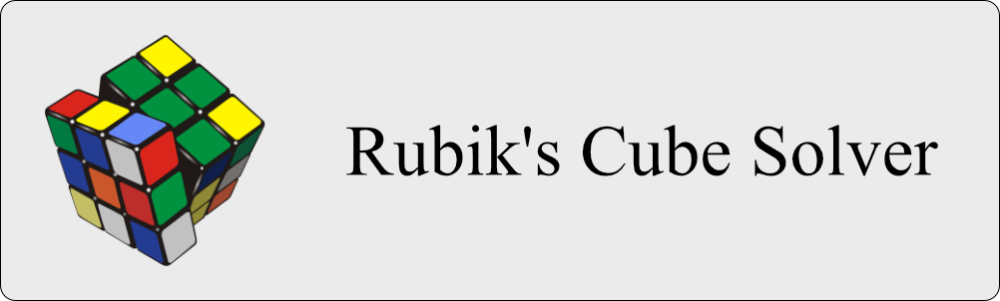
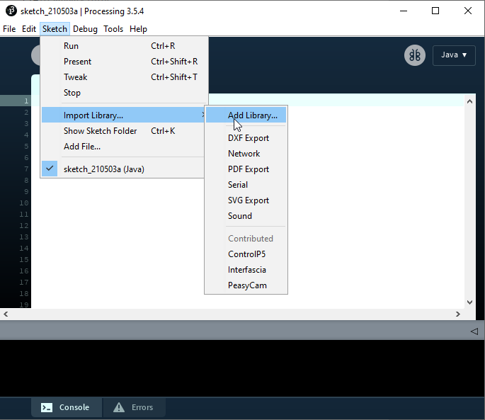
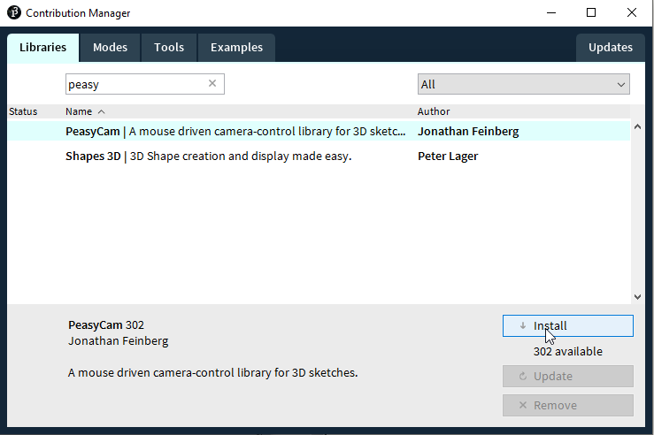
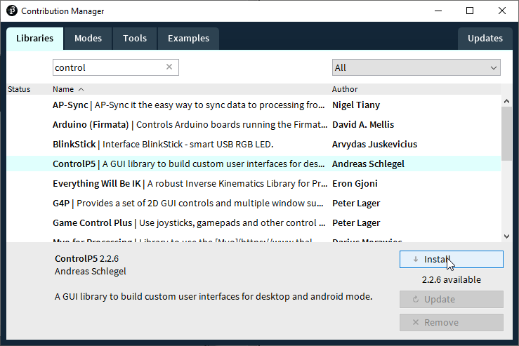
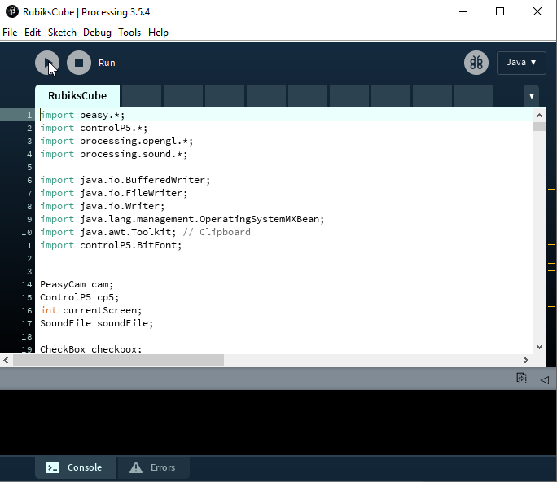
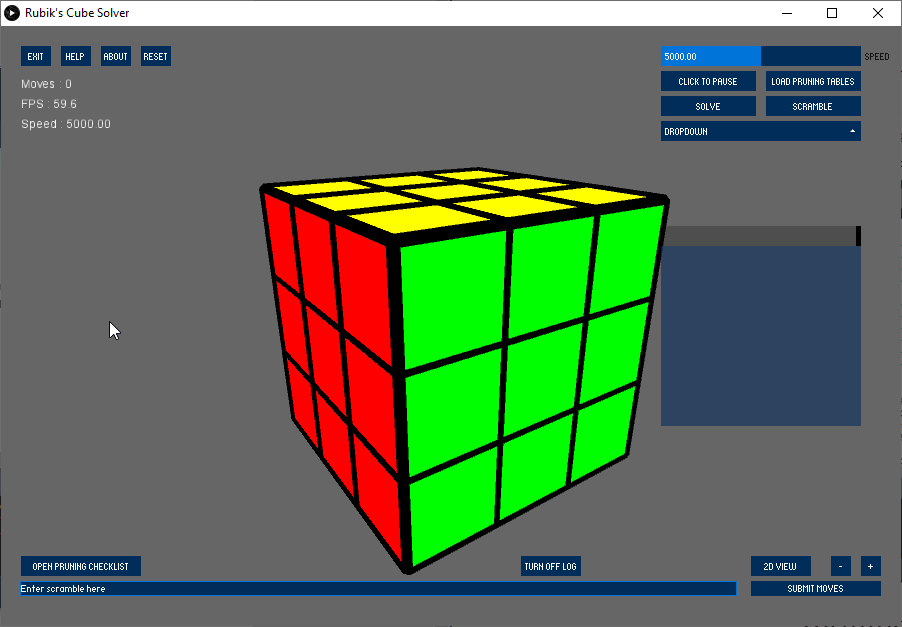
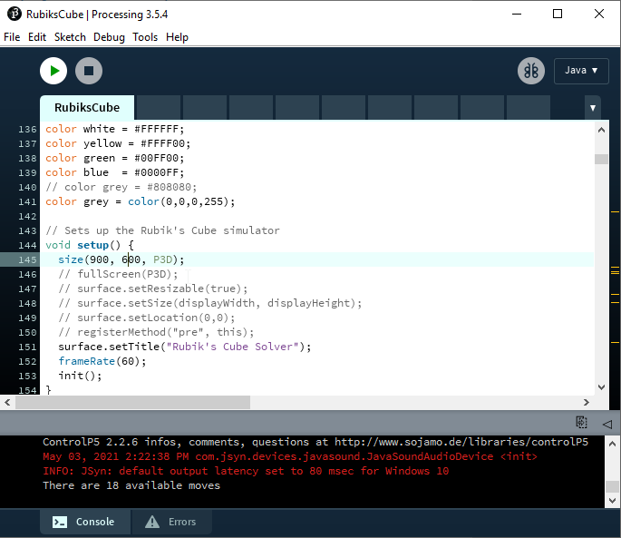
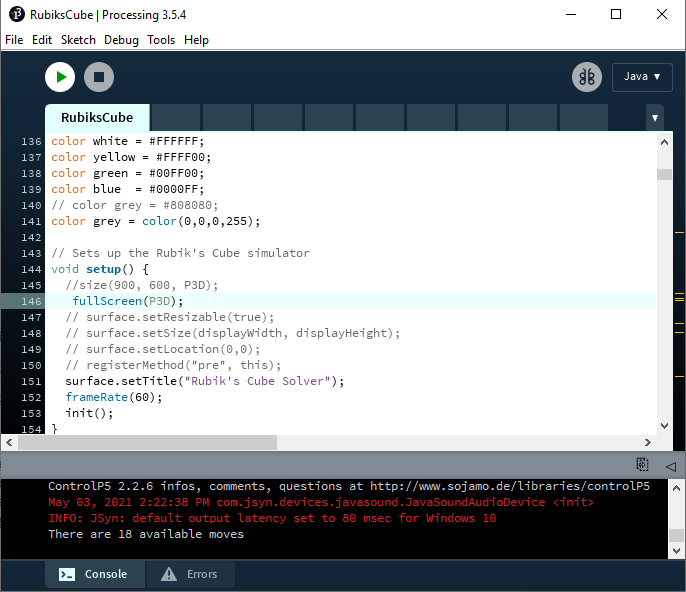
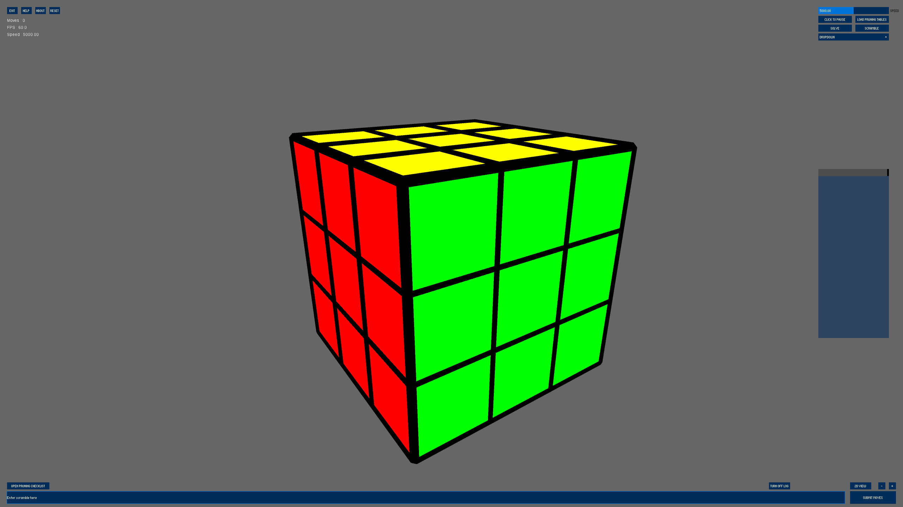

<h2 align = "center"> Computer solution of puzzle game - Rubik's Cube Solver </h2>

---

<h1>Final Year Project Links</h1>

- [Dissertation](https://www.overleaf.com/read/zjdyybvqmrqh)
- [Logbook](https://www.overleaf.com/read/bvgpbdzphwzf)
- [Demo and Presentation Video](http://www.youtube.com/watch?v=mErxPqnGuog)

<h1> Table of contents</h1>

1. [Project Setup](#setup)
2. [Terminology and Notation](#notation)
3. [Project Description](#desc)
4. [Project Goals](#achieve)
5. [Project Background](#skill)
6. [Development Stages](#stages)
7. [Development Issues](#issues)
8. [How to use the program (Under construction)](#howtouse)
9. [Creating a 'Faster' Cube](#fastercube)
10. [Log Book](#logbook)

---

<h1>Project Setup</h1> <a name="setup"></a>

Open a terminal / powershell window and download this repository's files via:

```text
git clone <this repository's link>
```

Once the files have been downloaded, proceed to the next steps.

1. Download and install [Processing](https://processing.org/download/)

   

2. Open Processing and click Sketch > Import Library > Add Library

   

3. Search for, download and install:

   1. PeasyCam

      

   2. ControlP5

      

4. Open RubiksCube.pde in the folder 'RubiksCube'

5. Click the play button

   

   

   To enter 'Presentation Mode' for best visibility, comment out line 145 and uncomment line 146. Have yet to add a stable run-time option for switching views; this is the best compromise.

   

   

   


<h1>Terminology and Notation</h1> <a name="notation"></a>
<h3>Terminology</h3>
<table align = "center">
  <tr> 
    <td>Cubie</td>
    <td>
    One of the many little cubes that make up an entire Rubik's cube.
    </td>
  </tr>
  <tr> 
    <td>Center</td>
    <td>
    A cubie with one colour on the face in the center of the cube.
    </td>
  </tr>
  <tr> 
    <td>Edge</td>
    <td>
    An edge cubie has two colours as they're on the edge of the cube.
    </td>
  </tr>
  <tr> 
    <td>Corner</td>
    <td>
    A corner cubie has 3 colours and there are always 8, regardless of cube size.
    </td>
  </tr>
  <tr> 
    <td>Face</td>
    <td>
    A face is a side of a Rubik's Cube. There are 6 faces regardless of size.
    </td>
  </tr>
  <tr> <! Space !> </tr>
  <tr> 
    <td colspan="2";>
      A letter by itself refers to a clockwise rotation of a single face by 90°.
    </td>
  </tr>
  <tr> 
    <td colspan="2";>
      A letter followed by an apostrophe is referenced to as a 'prime move' which means the face rotates counter-clockwise 90°.
    </td>
  </tr>
  <tr> 
    <td colspan="2";>
      A letter with the number 2 after it marks a double turn 180°.
    </td>
  </tr>
  <tr> 
    <td colspan="2";>
      X, Y, Z rotations aren't normally required to solve a cube. These are whole cube rotations.
    </td>
  </tr>
</table>


<h3>Notation</h3>

<table align="center">
<tr>
  <td></td>
  <td>Front</td>
  <td>Right</td>
  <td>Up</td>
  <td>Left</td>
  <td>Back</td>
  <td>Down</td>
  <td colspan="3">Entire cube rotation</td>
  <tr align="center">
  <td>Normal moves</td>
    <td>F</td><td>R</td><td>U</td><td>L</td><td>B</td><td>D</td><td>X</td><td>Y</td><td>Z</td>
  </tr>
  <tr align="center">
    <td>Prime moves</td>
    <td>F'</td><td>R'</td><td>U'</td><td>L'</td><td>B'</td><td>D'</td><td>X'</td><td>Y'</td><td>Z'</td>
  </tr>
  <tr align="center">
  <td>Double moves</td>
    <td>F2</td><td>R2</td><td>U2</td><td>L2</td><td>B2</td>
    <td>D2</td><td colspan="3"></td>
  </tr>
</table>

---

<h1>Project Description <a name="desc"></a></h1>

> "There is a wide variety of turn-based “solitaire” puzzle games. Often, these puzzles are [amenable](https://dictionary.cambridge.org/dictionary/english/amenable) to solution by computer, either using some kind of [heuristic-guided local search](https://www.youtube.com/watch?v=XUNGtxoBbPQ), or by encoding them as a [constraint-satisfaction problem](https://en.wikipedia.org/wiki/Constraint_satisfaction_problem) and using a generic external solver. The goal of this project is to produce a novel solver for such a game and **evaluate its effectiveness**. You might also consider the problem of how to *generate interesting puzzle instances of varying difficulty*. Some idea would be: Solver for "Rush Hour" block-sliding traffic puzzles; Solver and generator for Sokoban (crate pushing) puzzles; and Generator for crossword puzzles."

<h4> How can the 'puzzle instance' difficulty be changed?</h4>

By adding or subtracting [cubies](https://www.yourdictionary.com/cubie) to the overall Rubik's cube; increasing the difficulty and increasing the time in solving the puzzle.

---

<h2> Goals for this project <a name="achieve"></a></h2>

The first goal is to create an emulator of the puzzle game in question (Rubik's Cube) in order to be able to work on writing an algorithm for a computer to use in order to solve it. I've chosen [Processing Java](https://en.wikipedia.org/wiki/Processing_(programming_language)) as the language for the creation of this project as I already have some experience using this language. I started off using the [Processing IDE](https://processing.org/) but I discovered random bugs/issues when trying to debug/run my program which greatly lagged my computer so I switched over to using VSCode (a code editor) and imported the java-processing libraries in order for me to debug/run my program (performance has been much better since).
<h3> Main Objectives </h3>

- [x] Emulation of cube
- [x] Adding basic moves for cube
- [x] Scramble function for cube
- [x] Animation of each move
- [x] Reverse scramble of cube
- [ ] Adapt the code to cater for larger cubes - currently facing issues
- [x] Save computing power by only storing visible cubies
- [x] Adding [X, Y, Z](https://ruwix.com/the-rubiks-cube/notation/advanced/) rotations to cube.
- [x] Implement a human algorithm to solve the cube 
<details><summary>Steps</summary>
  - [x] Solve first layer's edges (White cross)
  - [x] Solve the first layer's corners (White face)
  - [x] Solve second layer of the cube (F2L)
  - [x] Create a yellow cross on top of the cube
  - [x] Swap yellow edges to match their partnered colours
  - [x] Position yellow corners
  - [x] Orient last layer corners
  </details>

<h3>Mandatory</h3>


- [ ] Use **search algorithm** and/or **constraint solvers** to solve well-specified problems
- [ ] Evaluate 'empirically' the effectiveness of a solution method for a problem - (This step will be the hardest I believe)
  - Computing power needed
  - Number of steps required to solve the cube
  - Time to solve the cube
- [x] Develop a computer implementation of a puzzle game.

<h3>Optional</h3>

- [x] Allow user to create custom cube sizes
- [x] Add a 2D visualisation of the cube
- [ ] Allow user to create a custom cube scramble
- [x] Provide output of scramble/solve steps to console for the user
- [x] (Unreal expectations right here) Solve the cube from its scrambled state in 20 moves or less - [God's number](https://www.cube20.org/#:~:text=New%20results%3A%20God's%20Number%20is,requires%20more%20than%20twenty%20moves) could be a factor used to help determine the efficiency (based on number of moves) of the solve. God's Number is the theory that any traditional 3x3x3 Rubik's cube can be solved in 20 moves or lesss.

---

<h2>Background <a name="skill"></a></h2>

- Local search (Heuristic-based)
- SAT / Constraint solver
- Sufficient knowledge of basic  programming conventions regarding the language being used to create the rubiks cube simulator/solver

> "A specific idea of a **puzzle game** you would like to write a solver for, and experience of solving instances of those puzzles yourself."

I've spent countless hours learning to solve Rubik's cubes of various sizes using human methods. During the learning process, I discovered that after solving the 3x3x3 cube is that you don't have to learn much more to solve cubes of larger sizes. I find the idea of emulating this puzzle on a computer for a computer to solve extremely interesting. I'm hoping by applying local search and SAT algorithms, this project will become a good stepping stone to integrating an algorithm that calculates  the most efficient solve (if not close to) for a cube in a scrambled state - I will be determining the general success of these solving algorithms off god's number.

---
<h2> Stages of creation</h2> <a name="stages"></a>
<details> <summary>Creation</summary>
<!--Stages 1 and 2-->
<table align = "center">
  <tr>
    <td>
      <h4>Stage 1 - Generate cube of cubies
    </td>
    <td>
      <h4>Stage 2 - Scramble cube
    </td>
  </tr>
  <tr>
    <td>
      <p align="center"></p>
    </td>
    <td>
    <p align="center"></p>
    </td>
  </tr>
  <tr>
   <td width = 25% align="">
   The first objective was to calculate the initial position of each cubie to build the 3x3x3 Rubik's Cube.
   </td>
   <td width = 25%>
   I created each possible move for the cube which required each face's axis and direction of the rotation for that face. I created a function that randomly generates moves and applies them to the cube.
   </td>
  </tr>
</table>

<!--Stages 3 and 4-->
<table align = "center">
  <tr>
    <td>
      <h4>Stage 3 - Animations | Notation | Counter
    </td>
    <td>
      <h4>Stage 4 - Reverse scramble
    </td>
  </tr>
  <tr>
    <td>
      <p align="center"></p>
    </td>
    <td>
    <p align="center"></p>
    </td>
  </tr>
  <tr>
   <td width = 25%>
   I followed the last part of Coding Train's tutorial for adding animation to the rotations of the cube's faces. I also added a counter to count each move and converted these moves to a string format to ensure each move was correct (I've since updated to proper notation as in a previous commit I used incorrect notation).
   </td>
   <td width = 25%>
   This was included in Coding Train's tutorial of creating the scramble - This involved storing the sequence of moves to scramble backwards somewhere else to then reverse each of the moves' directions. I then played these moves back and voila - the illusion of a solve.
   </td>
  </tr>
</table>

<!-- Stage 5 -->
<table align = "center";>
  <tr>
    <td colspan ="2">
      <h4>Stage 5 - Generating & scrambling different cube sizes and an unsuccessful scramble
    </td>
  </tr>
  <tr>
    <td>
      <p align="center"></p>
    </td>
    <td>
    <p align="center"></p>
    </td>
  </tr>
  <tr>
   <td width = 25%>
      This 5x5x5 cube scrambles / reverses scramble successfully after implementating a more versatile method of generating moves for each dimension of the cube. (gave me great amount of satisfaction after working on it for countless hours.)
   </td>
   <td width = 25%>
      When scrambling any even numbered cube that wasn't a 2x2x2, they all performed their moves incorrectly. The new positions calculated for the cubies to move to were incorrect - fortunately I found a solution which revolved around the imprecise calculations made in the turn function .
   </td>
  </tr>
</table>

<!-- Stage 6 - 7 -->
<table align = "center";>
  <tr>
    <td colspan ="2">
      <h4>Stage 6 - Remove inner cubies, colour visible faces, program information
    </td>
  </tr>
  <tr>
    <td colspan ="2">
      <p align="center"></p>
    </td>
  </tr>
  <tr>
   <td width = 25%>

The cube didn't display the bigger cubes correctly, see here > [Camera issue](#camissue). I stopped storing the inner cubies that were contained within the Rubik's Cube. This saves computing power, especially when creating a larger cube. Read more here > [Computing issue](#computingpowerissue).

I rethought the process in which colours were applied to each face of each cubie in the cube. I applied colours to only the visible faces of each cubie as I believe I can now check if neighbouring cubies have matching colours on matching faces to in-turn solve the cube using, at first, human methods. I've also fixed the issue of scrambling even dimensioned cubes > [Even number of dimensions cube scrambling issue](#evenissue).

Finally, minor additions include an FPS counter, speed control and the size of the cube.
   </td>
  </tr>
  <tr>
</table>
</details>

<details><summary>Human Algorithm solving process</summary>
Gifs coming soon.
</details>

---

<a name="issues"></a>
<h2>Issues faced during project creation</h2>
<details>
<summary><b>1. Notation issue<a name="notationissue"></a></b></summary>
Standard 3x3x3 cubes have a recognised notation for each move but as the cubes get bigger - typically beyond a 5x5x5 cube, the notation for moves being done aren't identifiable. However, this fortunately didn't mean I was limited in regards to actually generating moves for all edges of all cube sizes. The moves generated for each cube are based on the size of the cube itself which means the program will be able to scramble any sized cube... Or so I thought.

<br></br>
</details>

<details>
<summary><b>2. Computing power issue<a name="computingpowerissue"></a></summary></b> 

A 20x20x20 cube has 8,000 cubies. A 100x100x100 cube has a whopping 1,000,000 cubies. This is how I made my program - to store every cubie out of ease. However, the majority of these stored cubies are pretty useless as they're not visible to the user nor bring much functionality to the project which means the CPU would be unecessarily put under strain when calculating each cubie position when starting the program.

I created an enhanced for loop in a slightly different manner by starting from 0 and iterating until getting to the number of dimensions. The important part was the if statement I made. It checks to see if x, y and z coordinates of the next cubie is within the cube rather than outside. If there is, it skips storing that particular cubie and iterates the values of the for loops until it's stored all the corners, edges and center pieces. I found my computer was able to load and render a 100x100x100 cube in a couple seconds rather than crashing after a minute. 

For a 100x100x100 cube - 1,000,000 cubies would need to be stored.
In my program, 58,808 are being stored. Saving 941,192 useless cubies from being stored.

This isn't such an issue for a smaller cubes such as the traditional 3x3x3 Rubik's cube since the program only stores 27 cubies. So there's only one extra cubie being stored but for much bigger cubes, a computer struggles to load them, let alone scramble them.
<br></br>
</details>

<details>
<summary><b>3. Even number of dimensions cube scrambling issue<a name="evenissue"></a></b></summary>

After countless gruelling hours of research alongside trial and error, I finally managed to adapt my program to cater for displaying all cube sizes. The next objective was to see if they would scramble. It worked perfectly for cubes with an uneven number of dimensions but, as exampled above, any cube with an even number of dimensions would translate incorrectly when being scrambled. This occurred because when there were an even number of dimensions, the axis value increased by 1 which meant it iterated forward and backwards by 0.5. The values being calculated for the update function for each cubie were floats that weren't being correctly rounded to the nearest half (0.5) so they were rounded either up or down to the nearest integer since the values were literally 0.000001 away from an exact 0.5. I created a function to fix this rounding issue - therefore fixing the move issues for even numbered cubes.
<br></br>
</details>

<details>
<summary><b>4. Camera fov issue<a name = "camissue"></a></b></summary>

After resolving the computing power issue with storing cubies, I felt comfortable in displaying and scrambling larger cubes. The issue was that any cube with 40 or more dimensions had parts of the cube 'cut off'. I researched online and discovered a solution to displaying the entire cube, regardless of size with two PEasy cam related functions: setupCamera() and updateCamera().
  <details>
  <summary>Preview before and after fix was implemented</summary>
    <table align = "center">
        <tr>
            <td align = "center"><h4>Before</h4></td>
            <td align = "center"><h4>After</h4></td>
        </tr>
        <tr>
            <td><p align="center"></p></td>
            <td><p align="center"></p></td>
        </tr>
    </table>
  </details>
This means bigger cubies can fully display (which is going to look pretty impressive when they're solving)
<br></br>
</details>

<details>
<summary><b>5. Whole cube rotation<a name="wholecuberotation"></a> </b></summary>

X, Y, Z are moves that aren't required to solve a cube. However since a computer has the job of solving the cube, for the sake of simplicity when programming the algorithms, I will be relying on these whole cube rotations to reposition specific cubies to specific faces/axis on the cube. This means, after repositioning the entire cube, I will hopefully be able to re-use sets of moves to correctly position edge/corner cubies.

After days of research and mental pain, I managed to get the cube to rotate along the X, Y and Z axis. The issue that I didn't foresee or consider was the fact it didn't react well with moves made using my move class since it doesn't relocate each cubies' colours and reassign them new axis coordinates (This is what I did to achieve the full cube rotations).

So if I made any move on the cube and attempted to rotate the entire cube, it assumed the original state and positions of every colour of each cubie were still in the same places they were before scrambling - therefore failing to rotate the cubies to their correct new positions. Therefore I needed to find a way to either make single moves correlating with the logic I already have with rotating the entire cube.
<br></br>
</details>
<details>
<summary><b>6. Creating new move methods</b><a name="newmoves"></a></summary>

Due to my last issue ([Whole cube rotation](#wholecuberotation)) I had to abandon my move class and turning functions that I originally created to create new moves that correlates with the whole cube rotations logic. This is so I can rotate the entire cube regardless of what combination it's in (Something the last class couldn't tolerate). I've created these functions with the cube class as these movements are done on the cube.

Fortunately, I reused some of the functions I created for the entire cube rotations for the single face movements. I'm hoping to refine how it's laid out for ease of interpretation but for now it works. I will begin working on the human solving algorithm first before pursuing local search and SAT solver algorithms.

The current issue right now is that the move functions is only functioning with 3x3x3 cubes. Nothing bigger or smaller for now. I'm hoping to refine this asap.
<br></br>
</details>

---

<h2> How to use the program <a name="howtouse"></a></h2>
Gonna write this section later on...

---

<h2>Log Book<a name="logbook"></a></h2>
I'll be logging my progress as best as I can in my logbook linked below!

[Logbook](/misc/logbook.pdf)

[Bonus for you: Here's the current state of my dissertation](/misc/main.pdf)

---

<h2> Creating a faster cube<a name="fastercube"></a></h2>
When developing my selection algorithm, I quickly discovered that cloning my cube object, which is made of cubie and face objects, was extremely computationally expensive. This meant when I had a bunch of algorithms to test, the program had to create a new Rubik's cube for each algorithm it wanted to test. This wasn't so bad for algorithms up to a length of 4 moves but for anything that was 5 or more, it was an issue.
</br ></br >
After doing research online, I discovered that there are different and cheaper ways of representing the cube object in its scrambled state. The following are the main ideas I had found.


>1. A three-dimensional array of chars, 6x3x3. The color of a face is indexed like cube[SIDE][ROW][COL]. This is intuitive, but slow.
>2. A single array of 54 chars. This is faster than the first structure, and the row and stride are calculated manually (trivial). It’s still slow.
>3. 6 64-bit integers. This method is essentially a bitboard, for those familiar with the chess domain, and is significantly faster than methods one and two. Twisting can be done using bitwise operations, and face comparisons can be done using masks and 64-bit integer comparison.
>4. An array of corner cubies and a separate array of edge cubies. The elements of each array contain a cubie index (0–11 for edges; 0–7 for corners) and an orientation (0 or 1 for edges; 0, 1, or 2 for corners).

---

<h2> References <a name="references"></a></h2>

The intention here is to use these references as a guide or inspiration for features, ideas or conventions to apply my own Rubik's Cube Solver. 

<h5>Emulator help</h5>

1. [Python Rubiks Cube Solver](https://github.com/sylvain-reynaud/RubiksSolver/)
2. [Code Bullet Rubiks Cube Solver](https://github.com/Code-Bullet/RubiksCubeAI)
3. [Rotation Matrix Wiki Page](https://en.wikipedia.org/wiki/Rotation_matrix)
4. [Rubik's Cube Emulator - Part 1](https://www.youtube.com/watch?v=9PGfL4t-uqE)
5. [Rubik's Cube Emulator - Part 2](https://www.youtube.com/watch?v=EGmVulED_4M)
6. [Rubik's Cube Emulator - Part 3](https://www.youtube.com/watch?v=8U2gsbNe1Uo)
7. [PEasy Cam setup/update](https://forum.processing.org/two/discussion/27071/how-far-can-i-go-with-peasycam)
8. [Converting Processing to P5.JS (for live demo)](https://github.com/processing/p5.js/wiki/Processing-transition)

<h5>Information</h5>

9. [Rubik's Cube Notation](https://ruwix.com/the-rubiks-cube/notation/)
10. [Terminology and Notation](https://ruwix.com/the-rubiks-cube/notation/)

<h5>Human Algorithm References</h5>

11. [Part 1 (First Layer Edges)](https://ruwix.com/the-rubiks-cube/how-to-solve-the-rubiks-cube-beginners-method/step-1-first-layer-edges/)
12. [Part 2 (First Layer Corners)](https://ruwix.com/the-rubiks-cube/how-to-solve-the-rubiks-cube-beginners-method/step-2-first-layer-corners/)
13. [Part 3 (F2L - Second Layer)](https://ruwix.com/the-rubiks-cube/how-to-solve-the-rubiks-cube-beginners-method/step3-second-layer-f2l/)
14. Part 4 [(Yellow Cross)]()
15. Part 5 [(Swap yellow edges)]()
16. Part 6 [(Position yellow corners)]()
17. Part 7 [(Orient last layer corners)]()

<h5>Other</h5>

14. [Markdown Cheatsheet](https://guides.github.com/pdfs/markdown-cheatsheet-online.pdf)